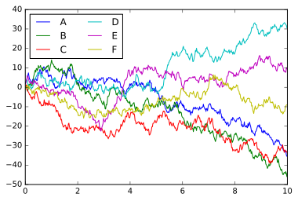

## 1. Object-oriented interface

### 1.1 MATLAB-style interface


```python
import numpy as np
import matplotlib.pyplot as plt
```


```python
x = np.linspace(0, 10, 100)
plt.figure()
# create the first of two panels and set current axis 
plt.subplot(2, 1, 1) # (rows, columns, panel number) 
plt.plot(x, np.sin(x))
# create the second panel and set current axis 
plt.subplot(2, 1, 2) 
plt.plot(x, np.cos(x));
```


### 1.2 Object-oriented interface


```python
# First create a grid of plots 
# ax will be an array of two Axes objects 
fig, ax = plt.subplots(2)

# Call plot() method on the appropriate object 
ax[0].plot(x, np.sin(x)) 
ax[1].plot(x, np.cos(x));
```


## 2. Simple Line Plots

### 2.1 Adjusting the Plot: Line Colors and Styles

- The **figure** (an instance of the class plt.Figure) can be thought of as a single container that contains all the objects representing axes, graphics, text, and labels. 
- The **axes** (an instance of the class plt.Axes) is what we see above: a bounding box with ticks and labels, which will eventually contain the plot elements that make up our visualization. 


```python
%matplotlib inline 
import matplotlib.pyplot as plt 
plt.style.use('seaborn-whitegrid') 
import numpy as np
```

For all Matplotlib plots, we start by creating a figure and an axes. 

In their simplest form, a figure and axes can be created as follows 

More information about `color` and `linestyle`, see ["document of plt.plot"](https://matplotlib.org/3.3.3/api/_as_gen/matplotlib.pyplot.plot.html)


```python
fig = plt.figure() 
ax = plt.axes()
x = np.linspace(0, 10, 1000) 
ax.plot(x, np.sin(x), color='blue', linestyle='--')
ax.plot(x, np.cos(x), color='red');
```


### 2.2 Adjusting the Plot: Axes Limits
More information about **axis**, see ["document of plt.axis"](https://matplotlib.org/3.3.3/api/_as_gen/matplotlib.pyplot.axis.html)


```python
# method 1: .axis
plt.plot(x, np.sin(x)) 
plt.axis([-1, 11, -1.5, 1.5]);
# method 2: .xlim and .ylim
# plt.plot(x, np.sin(x))
# plt.xlim(-1, 11) 
# plt.ylim(-1.5, 1.5);
```


```python
plt.plot(x, np.sin(x)) 
plt.axis('equal');
# plt.axis('tight');
# plt.axis('square');
# plt.axis('off')
```


### 2.3 Labeling Plots
object-orientied methods
- `plt.xlabel()` → `ax.set_xlabel()` 
- `plt.ylabel()` → `ax.set_ylabel()` 
- `plt.xlim()` → `ax.set_xlim()` 
- `plt.ylim()` → `ax.set_ylim()` 
- `plt.title()` → `ax.set_title()`


```python
## MATLAB-style function
plt.plot(x, np.sin(x), '-g', label='sin(x)') # pay attention to set label for each line
plt.plot(x, np.cos(x), ':b', label='cos(x)') 
plt.axis('equal')
plt.legend();
```


```python
ax = plt.axes()
ax.plot(x, np.sin(x), '-b', label='sin(x)') # pay attention to set label for each line
ax.plot(x, np.cos(x), ':r', label='cos(x)')
ax.set(xlim=(0,10), ylim=(-2,2), xlabel='x', ylabel='y', title='A Sine Curve')
ax.legend();
```


## 3. Simple Scatter Plots
`plt.plot` should be preferred over `plt.scatter` for large datasets


```python
from sklearn.datasets import load_iris
iris = load_iris()
features = iris.data.T
```


```python
# alpha means the transparency
plt.scatter(features[0], features[1], alpha=0.5, s=features[3]*100, c=iris.target, cmap='viridis');
plt.colorbar(); # show color scale
```


## 5. Density and Contour Plots


```python
%matplotlib inline 
import matplotlib.pyplot as plt 
plt.style.use('seaborn-white') 
import numpy as np
```


```python
def f(x, y):
    return np.sin(x) ** 10 + np.cos(10 + y * x) * np.cos(x)
x = np.linspace(0, 5, 50) 
y = np.linspace(0, 5, 40)
X, Y = np.meshgrid(x, y) # builds two-dimensional grids from one-dimensional arrays
Z = f(X, Y)
```

By default when a single color is used negative values are represented by dashed lines, and positive values by solid lines


```python
plt.contour(X, Y, Z, colors='black');
```


```python
plt.contour(X, Y, Z, 20, cmap='RdGy');
```


a filled contour plot using the `plt.contourf()` function


```python
plt.contourf(X, Y, Z, 20, cmap='RdGy')
plt.colorbar();
```


- `plt.imshow()` doesn’t accept an $x$ and $y$ grid, so you must manually specify the extent \[xmin, xmax, ymin, ymax] of the image on the plot.
- `plt.imshow()` by default follows the standard image array definition where the origin is in the **upper left**, not in the lower left as in most contour plots.


```python
plt.imshow(Z, extent=[0, 5, 0, 5], origin='lower', cmap='RdGy')
plt.colorbar() 
plt.axis(aspect='image');
```


```python
contours = plt.contour(X, Y, Z, 3, colors='black') 
plt.clabel(contours, inline=True, fontsize=8)
plt.imshow(Z, extent=[0, 5, 0, 5], origin='lower', cmap='RdGy', alpha=0.5)
plt.colorbar();
```


## 6. Histograms, Binnings, and Density

### 6.1 Hist


```python
%matplotlib inline 
import numpy as np 
import matplotlib.pyplot as plt 
plt.style.use('seaborn-white')
data = np.random.randn(1000)
```

- `bins`：the number of equal-width bins in the range
- `density`: if true, draw and return a probability density (frequency)


```python
plt.hist(data, bins=30, density=True, alpha=0.5, histtype='stepfilled', color='steelblue',edgecolor='none');
```


### 6.2 Two-Dimensional Histograms and Binnings


```python
# generate a multivariate Gaussian distribution
mean = [0, 0] 
cov = [[1, 1], [1, 2]] 
x, y = np.random.multivariate_normal(mean, cov, 10000).T
```


```python
plt.hist2d(x, y, bins=30, cmap='Blues') 
cb = plt.colorbar() 
cb.set_label('counts in bin')
```


represents a two-dimensional dataset binned within a grid of hexagons


```python
plt.hexbin(x, y, gridsize=30, cmap='Blues') 
cb = plt.colorbar(label='count in bin')
```


## 7. Customizing Plot Legends

The simplest legend can be created with the `plt.legend()` command, which automatically creates a legend for any **labeled** plot elements


```python
import matplotlib.pyplot as plt
plt.style.use('classic')
import numpy as np
```

- use `ncol` to specify the number of columns in the legend
- use `frameon` to turn off the frame


```python
x = np.linspace(0, 10, 1000) 
fig, ax = plt.subplots() 
ax.plot(x, np.sin(x), '-b', label='Sine') 
ax.plot(x, np.cos(x), '--r', label='Cosine') 
ax.axis('equal') 
ax.legend(loc='upper left', frameon=False, ncol=2);
```


use a rounded box (`fancybox`) or add a shadow, change the transparency (alpha value) of the frame, or change the padding around the text


```python
ax.legend(fancybox=True, framealpha=1, shadow=True, borderpad=1)
fig
```


### 7.1 Multuple Legends
By creating a new legend artist from scratch, and then using the lower-level `ax.add_artist()` method to manually add the second artist to the plot 


```python
fig, ax = plt.subplots()
lines = []
styles = ['-', '--', '-.', ':']
x = np.linspace(0, 10, 1000)
for i in range(4):
    lines += ax.plot(x, np.sin(x - i * np.pi / 2), styles[i], color='black')
ax.axis('equal');
```


```python
# specify the lines and labels of the first legend 
ax.legend(lines[:2], ['line A', 'line B'], loc='upper right', frameon=False)
fig
```


```python
# Create the second legend and add the artist manually. 
from matplotlib.legend import Legend 
leg = Legend(ax, lines[2:], ['line C', 'line D'], loc='lower right', frameon=False)
ax.add_artist(leg);
fig
```


## 8. Multiple Subplots


```python
import matplotlib.pyplot as plt 
plt.style.use('seaborn-white') 
import numpy as np
```

### 8.1 `plt.axes`: Subplots by Hand

- These numbers represent \[bottom, left, width, height] in the figure coordinate system
- Starting at 65% of the width and 65% of the height of the figure.
- The size of the axes is 20% of the width and 20% of the height of the figure


```python
ax1 = plt.axes() # standard axes
ax2 = plt.axes([0.65, 0.65, 0.2, 0.2])
```


The equivalent of this command within the object-oriented interface is `fig.add_axes()`


```python
fig = plt.figure() 
ax1 = fig.add_axes([0.1, 0.5, 0.8, 0.4], xticklabels=[], ylim=(-1.2, 1.2)) # no tick labels
ax2 = fig.add_axes([0.1, 0.1, 0.8, 0.4], ylim=(-1.2, 1.2)) # 0.1 + 0.4 = 0.5
x = np.linspace(0, 10) 
ax1.plot(np.sin(x)) 
ax2.plot(np.cos(x));
```


### 8.2 `plt.subplot`: Simple Grids of Subplots

Three integer arguments: the number of rows, the number of columns, and the index of the plot to be created in this scheme, which runs from the upper left to the bottom right


```python
fig = plt.figure()
fig.subplots_adjust(hspace=0.4, wspace=0.4) # specify the spacing along the height and width of the figure
for i in range(1, 7): 
    ax = fig.add_subplot(2, 3, i) 
    ax.text(0.5, 0.5, str((2, 3, i)), fontsize=18, ha='center')
```


### 8.3 `plt.subplots`: The Whole Grid in One Go
- Can hide the x- and y-axis labels on the inner plots
- Simpler than `plt.subplot`


```python
# all axes in the same row share their y-axis scale
# and all axes in the same column share their x-axis scale
fig, ax = plt.subplots(2, 3, sharex='col', sharey='row')
```


```python
# axes are in a two-dimensional array, indexed by [row, col] 
for i in range(2): 
    for j in range(3): 
        ax[i, j].text(0.5, 0.5, str((i, j)), fontsize=18, ha='center')
fig
```


### 8.4 `plt.GridSpec`: More Complicated Arrangements


```python
grid = plt.GridSpec(2, 3, wspace=0.4, hspace=0.3) # set 2 rows and 3 cols
plt.subplot(grid[0, 0]) 
plt.subplot(grid[0, 1:]) # combine subplots of the first row, the last 2 columns
plt.subplot(grid[1, :2]) # combine subplots of the second row, the first 2 cols
plt.subplot(grid[1, 2]);
```


```python
# Create some normally distributed data 
mean = [0, 0] 
cov = [[1, 1], [1, 2]] 
x, y = np.random.multivariate_normal(mean, cov, 3000).T
```


```python
# Set up the axes with gridspec 
fig = plt.figure(figsize=(6, 6)) # 6 rows and 6 cols
grid = plt.GridSpec(4, 4, hspace=0.2, wspace=0.3) 
# combine the subplots of the first 5 columns, the last 5 columns 
main_ax = fig.add_subplot(grid[:-1, 1:]) 
# combine the subplots of the first 5 columns, the first columns
y_hist = fig.add_subplot(grid[:-1, 0], xticklabels=[], sharey=main_ax)
# combine the subplots of the last row, the last 5 columns 
x_hist = fig.add_subplot(grid[-1, 1:], yticklabels=[], sharex=main_ax)
```


```python
# scatter points on the main axes 
main_ax.plot(x, y, 'ok', markersize=3, alpha=0.2)
# histogram on the attached axes 
x_hist.hist(x, 40, histtype='stepfilled', orientation='vertical', color='gray')
x_hist.invert_yaxis() # # Invert along the X-axis
y_hist.hist(y, 40, histtype='stepfilled', orientation='horizontal', color='gray')
y_hist.invert_xaxis() # Invert along the X-axis
fig
```


## 9. Text and Annotation


```python
import matplotlib.pyplot as plt 
import matplotlib as mpl 
plt.style.use('seaborn-whitegrid') 
import numpy as np 
import pandas as pd
```

### 9.1 Transforms and Text Position

- `ax.transData`: Transform associated with data coordinates
- `ax.transAxes`: In percentage, transform associated with the axes (in units of axes dimensions)
- `fig.transFigure`: In percentage, transform associated with the figure (in units of figure dimensions)

If we change the axes limits, it is only the `transData` coordinates that will be affected, while the others remain stationary


```python
fig, ax = plt.subplots(facecolor='lightgray') 
ax.axis([0, 10, 0, 10])
# transform=ax.transData is the default, but we'll specify it anyway 
ax.text(1, 5, ". Data: (1, 5)", transform=ax.transData) 
ax.text(0.5, 0.1, ". Axes: (0.5, 0.1)", transform=ax.transAxes) 
ax.text(0.5, 0.5, ". Figure: (0.5, 0.5)", transform=fig.transFigure);
```


### 9.2 Arrows and Annotation

- `plt.annotate()` function creates some text and an arrow, and the arrows can be very flexibly specified.
- The arrow style is controlled through the `arrowprops` dictionary, which has numerous options available. 
- More information see [matplotlib.pyplot.annotate](https://matplotlib.org/3.3.3/api/_as_gen/matplotlib.pyplot.annotate.html)
- More inforamtion about `connectionstyle`, see [Advanced Annotation](https://matplotlib.org/3.3.3/tutorials/text/annotations.html#plotting-guide-annotation)


```python
fig, ax = plt.subplots()
x = np.linspace(0, 20, 1000) 
ax.plot(x, np.cos(x)) 
ax.axis('equal')
ax.annotate('local maximum', xy=(6.28, 1), xytext=(10, 4), arrowprops=dict(facecolor='black', shrink=0.05))
ax.annotate('local minimum', xy=(5 * np.pi, -1), xytext=(15.5, -4), arrowprops=dict(arrowstyle="->", connectionstyle="angle3,angleA=0,angleB=-90"));
```


## 10. Customizing Ticks
### 10.1 Hiding Ticks or Labels


```python
fig2 = plt.figure()
ax = plt.axes() 
ax.plot(np.random.rand(50));
```


```python
ax.yaxis.set_major_formatter(plt.NullFormatter()) 
ax.xaxis.set_major_locator(plt.NullLocator())
fig2
```


### 10.2 Reducing or Increasing the Number of Ticks
One common problem with the default settings is that smaller subplots can end up with crowded labels.

We can fix this with the `plt.MaxNLocator()`, which allows us to specify the maximum number of ticks that will be displayed


```python
fig, ax = plt.subplots(4, 4, sharex=True, sharey=True)
```


```python
for axi in ax.flat: 
    axi.xaxis.set_major_locator(plt.MaxNLocator(3)) 
    axi.yaxis.set_major_locator(plt.MaxNLocator(3))
fig
```


### 10.3 Fancy Tick Formats


```python
# Plot a sine and cosine curve 
fig, ax = plt.subplots() 
x = np.linspace(0, 3 * np.pi, 1000) 
ax.plot(x, np.sin(x), lw=3, label='Sine') 
ax.plot(x, np.cos(x), lw=3, label='Cosine')
# Set up grid, legend, and limits 
ax.grid(True) 
ax.legend(frameon=False) 
ax.axis('equal') 
ax.set_xlim(0, 3 * np.pi);
```


We can do some changes to improve the aboved figure. 

First, it’s more natural for this data to space the ticks and grid lines in multiples of π.

We can do this by setting a `MultipleLocator`, which locates ticks at a multiple of the number you provide.


```python
ax.xaxis.set_major_locator(plt.MultipleLocator(np.pi / 2)) 
ax.xaxis.set_minor_locator(plt.MultipleLocator(np.pi / 4)) 
fig
```


## 11. Customizing Matplotlib: Configurations and Stylesheets
### 11.1 Stylesheets


```python
plt.style.available[:5]
```


    ['bmh', 'classic', 'dark_background', 'fast', 'fivethirtyeight']


```python

def hist_and_lines(): 
    np.random.seed(0) 
    fig, ax = plt.subplots(1, 2, figsize=(11, 4)) 
    ax[0].hist(np.random.randn(1000)) 
    for i in range(3): 
        ax[1].plot(np.random.rand(10))
        ax[1].legend(['a', 'b', 'c'], loc='lower left')
hist_and_lines()
```


```python
with plt.style.context('classic'): 
    hist_and_lines()
```


```python
with plt.style.context('ggplot'): 
    hist_and_lines()
```


## 12 Three-Dimensional Plotting in Matplotlib

We enable three-dimensional plots by importing the `mplot3d` toolkit: 

Once this submodule is imported, we can create a three-dimensional axes by passing the keyword `projection='3d'` to any of the normal axes creation routines:


```python
from mpl_toolkits import mplot3d
%matplotlib inline
import numpy as np 
import matplotlib.pyplot as plt
```

### 12.1 Three-Dimensional Points and Lines


```python
fig = plt.figure() 
ax = plt.axes(projection='3d')
```


```python
# Data for a three-dimensional line 
zline = np.linspace(0, 15, 1000) 
xline = np.sin(zline) 
yline = np.cos(zline) 
ax.plot3D(xline, yline, zline, 'gray')
# Data for three-dimensional scattered points 
zdata = 15 * np.random.random(100) 
xdata = np.sin(zdata) + 0.1 * np.random.randn(100) 
ydata = np.cos(zdata) + 0.1 * np.random.randn(100) 
ax.scatter3D(xdata, ydata, zdata, c=zdata, cmap='Greens');
fig
```


### 12.2 Three-Dimensional Contour Plots
Like two-dimensional `ax.contour` plots, `ax.contour3D` requires all the input data to be in the form of two-dimensional regular grids, with the Z data evaluated at each point.


```python
def f(x, y): 
    return np.sin(np.sqrt(x ** 2 + y ** 2))
x = np.linspace(-6, 6, 30) 
y = np.linspace(-6, 6, 30)
X, Y = np.meshgrid(x, y) 
Z = f(X, Y)

```


```python
fig = plt.figure() 
ax = plt.axes(projection='3d') 
ax.contour3D(X, Y, Z, 50, cmap='viridis') 
ax.set_xlabel('x') 
ax.set_ylabel('y') 
ax.set_zlabel('z');
```


Sometimes the default viewing angle is not optimal, in which case we can use the `view_init` method to set the elevation and azimuthal angles

Here, we’ll use **an elevation of 60 degrees** (that is, 60 degrees above the x-y plane) and **an azimuth of 35 degrees** (that is, rotated 35 degrees counter-clockwise about the z-axis)


```python
ax.view_init(60, 45) 
fig
```


### 12.3 Wireframes and Surface Plots


```python
fig = plt.figure() 
ax = plt.axes(projection='3d') 
ax.plot_wireframe(X, Y, Z, color='black') 
ax.set_title('wireframe');
```


```python
ax = plt.axes(projection='3d') 
ax.plot_surface(X, Y, Z, rstride=1, cstride=1, cmap='viridis', edgecolor='none')
ax.set_title('surface');
```


### 12.4 Surface Triangulations 

For some applications, the evenly sampled grids required by the preceding routines are overly restrictive and inconvenient. 

In these situations, the triangulation-based plots can be very useful. 


```python
theta = 2 * np.pi * np.random.random(1000) 
r = 6 * np.random.random(1000) 
x = np.ravel(r * np.sin(theta)) 
y = np.ravel(r * np.cos(theta)) 
z = f(x, y) # z is an array rather than a 2-dim grid
```


```python
ax = plt.axes(projection='3d') 
ax.scatter(x, y, z, c=z, cmap='viridis', linewidth=0.5);
```


- This leaves a lot to be desired. 
- The function that will help us in this case is `ax.plot_trisurf`, which creates a surface by first finding a set of triangles formed between adjacent points 
- Remember that x, y, and z here are one-dimensional arrays


```python
ax = plt.axes(projection='3d') 
ax.plot_trisurf(x, y, z, cmap='viridis', edgecolor='none');
```


## 13. Visualization with Seaborn
### 13.1 Seaborn Versus Matplotlib
Seaborn has many of its own high-level plotting routines, but it can also overwrite Matplotlib’s default parameters and in turn get even simple Matplotlib scripts to produce vastly superior output.


```python
import matplotlib.pyplot as plt 
plt.style.use('classic') 
%matplotlib inline 
import numpy as np 
import pandas as pd
```


```python
# Create some data 
rng = np.random.RandomState(0) 
x = np.linspace(0, 10, 500) 
y = np.cumsum(rng.randn(500, 6), 0)
# Plot the data with Matplotlib defaults 
plt.plot(x, y) 
plt.legend('ABCDEF', ncol=2, loc='upper left');
```





We can set the style by calling Seaborn’s `set()` method.


```python
import seaborn as sns 
sns.set()
```


```python
# same plotting code as above! 
plt.plot(x, y) 
plt.legend('ABCDEF', ncol=2, loc='upper left');
```


### 13.2 Histograms, KDE, and densities


```python
data = np.random.multivariate_normal([0, 0], [[5, 2], [2, 2]], size=2000) 
data = pd.DataFrame(data, columns=['x', 'y'])
# note that data is a dataframe
for col in 'xy': 
    plt.hist(data[col], normed=True, alpha=0.5)
```


Rather than a histogram, we can get a smooth estimate of the distribution using a kernel density estimation, which Seaborn does with `sns.kdeplot`


```python
for col in 'xy': 
    sns.kdeplot(data[col], shade=True)
```


Histograms and KDE can be combined using `sns.distplot()`


```python
sns.distplot(data['x']) 
sns.distplot(data['y']);
```


If we pass the full two-dimensional dataset to kdeplot, we will get a two-dimensional visualization of the data


```python
sns.kdeplot(data);
```


We can see the joint distribution and the marginal distributions together using `sns.jointplot`.


```python
with sns.axes_style('white'): 
    sns.jointplot("x", "y", data, kind='kde');
```


```python
# There are other parameters that can be passed to jointplot
# we can use a hexagonally based histogram instead
with sns.axes_style('white'): 
    sns.jointplot("x", "y", data, kind='hex')
```


```python

```